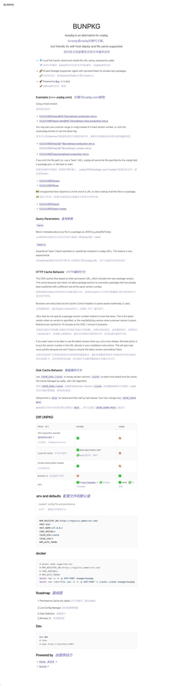

# BUNPKG

> bunpkg is an alternative for, powered by bun! friendly for private deploy and file cache supported.

## Diff unpkg

| feture                                                                                          | bunpkg                                                                 | unpkg    |
| ----------------------------------------------------------------------------------------------- | ---------------------------------------------------------------------- | -------- |
| 302 supported, example [npmmirror.com](https://registry.npmmirror.com/react/-/react-18.2.0.tgz) | ✅                                                                     | 🚫       |
| Local File Cache                                                                                | ✅ does nginx better, aha?                                             | 🚫       |
| private Authorization header                                                                    | ✅                                                                     | 🚫       |
| Browser UI                                                                                      | 🚫                                                                     | ✅       |
| esm                                                                                             | ✅ by [Bun.Transpiler](https://bun.sh/docs/api/transpiler#scanimports) | ✅ babel |

## .env

> maybe?: config file and persistence

```bash
NPM_REGISTRY_URL=https://registry.npmmirror.com/
PORT=4567
HOST_NAME=127.0.0.1
CORS_ORIGIN=*
ORIGIN=
CACHE_DIR=/cache
CACHE_GIB=4
NPM_AUTH_TOKEN=
```

## docker

```bash
# docker mode env is limited to
# NPM_REGISTRY_URL=https://registry.npmmirror.com/
# CORS_ORIGIN=*
# ORIGIN=*
# CACHE_GIB=4
# NPM_AUTH_TOKEN=
docker run -i -t -p 4567:4567 chaogpt/bunpkg
docker run --env-file .env -i -t -p 4567:4567 -v /cache:./cache chaogpt/bunpkg
```

## Roadmap

- [x] Persistence Cache (by sqlite)
- [] More Private Config , like [esm.sh](https://github.com/esm-dev/esm.sh/blob/main/config.example.jsonc)
- [] Live Config Manager
- [] Data Statistics
- [] Browser UI

## Dev

```bash
bun dev
# then
# open http://localhost:4567
```

## ScreenShot



## Powered by

- [Elysia](https://elysiajs.com/)
- [bun.sh](https://bun.sh/)
